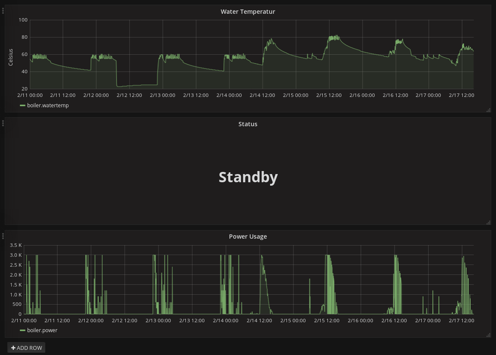

AC ELWA-E to influx
==================

Replace this config in `__main__.py` with the right values.

```
BOILER = {
    "url": "http://hostname/data.xml",
    "name": "lename":
}

INFLUX = {
    "url": "https://hostname:8086/write?db=databasename", 
    "username":"leuser", 
    "password":"lepassword"
}
```


